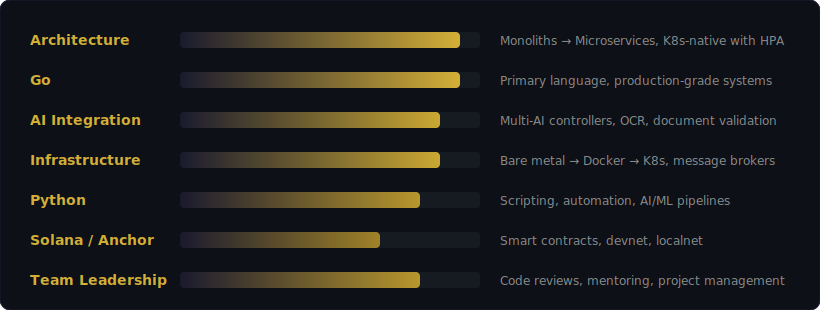

 

<samp><i>I use AI to automate the hands, not the brain</i></samp>

 

## <samp>About Me</samp>

 

Designing system architecture from scratch and refactoring legacy monoliths into scalable microservices under **Kubernetes with HPA**. Primary language — **Go**. Building production-grade, fault-tolerant services with clean code and solid documentation.

 

Integrating AI into business processes — from code automation to building **multi-AI controllers** for document recognition, validation, and anti-scam. Creating resilient multi-model pipelines that handle failures gracefully.

 

Setting up full servers from **bare metal** — configs, networking, orchestration, deployment. Docker, Kubernetes, Redis, RabbitMQ, S3/MinIO — can wire it all up from zero.

 

Writing **smart contracts on Solana** using **Anchor framework**. Working with devnet, localnet, and mainnet deployments.

 

Managing dev teams, owning projects end-to-end, running non-stop code reviews. Balancing hands-on engineering with technical leadership.

 

## <samp>Impact</samp>

| | Achievement | Result |
|:---:|:---|:---|
| :shield: | Built an **anti-scam system** from scratch — multi-AI pipeline for document validation and fraud detection | **Saved $200k+ / year** |
| :wrench: | **Monolith → microservices** refactor + consolidating instances into a single scalable module under K8s | **Saved €60k+ / year** |

 

## <samp>Tech Stack</samp>

<b>Languages</b>

 

-0D1117?style=for-the-badge&logo=rust&logoColor=D4AF37)

<b>Blockchain</b>

 

<b>Infrastructure & DevOps</b>

 

<b>Cloud & Platform</b>

 

<b>API & Architecture</b>

 

 

## <samp>Expertise</samp>

 

## <samp>GitHub Stats</samp>

&nbsp;&nbsp;

  

 

